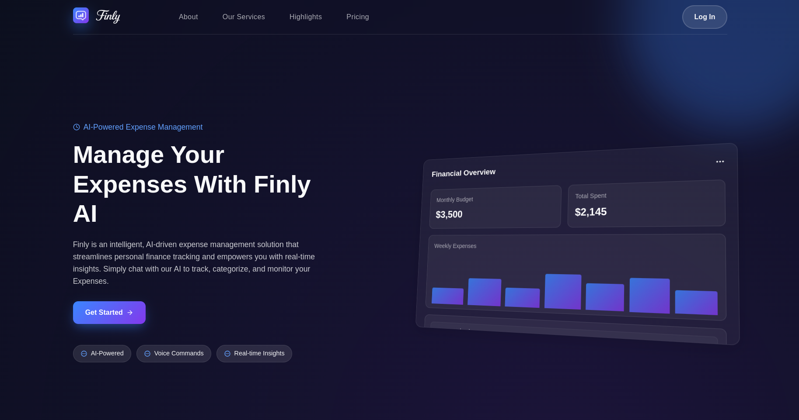
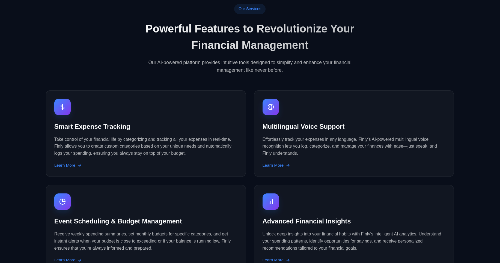
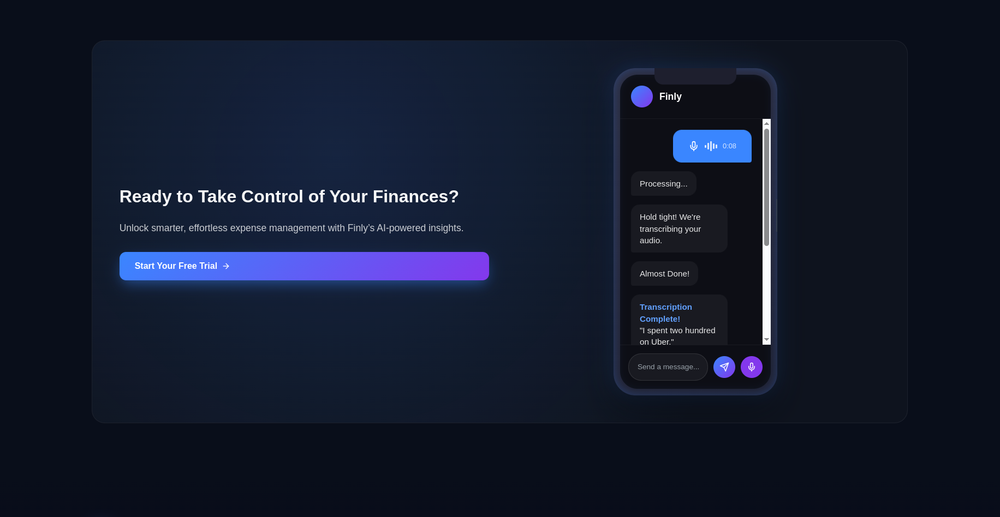

<div align="center" markdown="1">
	
	<h1>Finly - Whisper Wealth</h1>

**Whisper Wealth — Intelligent, Conversational Expense Management for the Future of Personal Finance**
</div>

<div align="center">
	<a target="_blank" href="#license" title="License: MIT"></a>
</div>
<br>
<div align="center">
	
</div>
<br>
<div align="center">
    <a href="https://two-korecent.frappe.cloud/frontend/">Website</a>
	<a href=".github/demo_video/finly-demo-video.mp4">Demo Video</a>
</div>

## Finly

Finly is an AI-powered, intelligent expense management solution crafted for effortless financial control.  
Seamlessly integrated with messaging platforms like **Telegram**, Finly introduces a frictionless, conversational way to track, manage, and gain real-time insights into your finances — via text or voice commands.

Built on the scalable **Frappe Framework**, Finly combines the power of automation, smart categorization, and intuitive dashboards, making personal finance management second nature.

## Motivation

Managing finances shouldn’t feel like a chore.  
Finly was born to reimagine personal finance: **natural, real-time, and adaptive to your lifestyle**.  
By embedding finance tracking into your daily conversations, Finly removes friction, making it as simple as sending a message.

Our mission: **To empower individuals with real-time control over their financial well-being, anytime, anywhere.**

## Key Features

- **Smart Voice-Enabled Expense Logging**  
  Log expenses, track balance, and set budgets effortlessly with natural voice commands — no typing needed.

- **Dynamic Fund Request & Approval System**  
  Linked users can request funds, while primary accounts maintain full control with seamless approval/rejection workflows.

- **Custom Categories & Budget Controls**  
  Tailor your financial ecosystem with personalized spending categories and adjustable budgets to match your goals.

- **Unified Financial Dashboard**  
  Access a centralized dashboard offering real-time visibility into transactions, balances, and overall financial health.

- **Proactive Budget Notifications**  
  Get intelligent alerts as you approach budget limits, helping you make smarter financial decisions instantly.

- **Automated Spending & Savings Insights**  
  Receive weekly summaries and monthly savings highlights — fostering healthier money habits over time.

- **Accessible Anytime, Anywhere**  
  Enjoy secure web access without extra fees — manage your finances on the go, with complete peace of mind.

<details>
<summary>Preview</summary>



</details>

## Getting Started

### Hosted Version

You can directly start using Finly by visiting:  
👉 [**finly.ai**](https://two-korecent.frappe.cloud/frontend/)

No installations, no hassle — sign up and start managing your finances with AI superpowers.

## 🛠️ Development Setup

To run Finly locally for development:

### Prerequisites

Ensure you have a working **Frappe bench** installed.  
You can follow the official [Frappe installation guide](https://docs.frappe.io/framework/user/en/installation) to set up your environment.

### Steps

```
cd your-bench-directory
```

```
bench get-app finly https://github.com/Siddharthkhati/Finly-Whisper-Wealth.git

bench --site your-site-name install-app expense_tracker
```

```
bench start
```

<br>
<br>
<div align="center">
	<a href="https://two-korecent.frappe.cloud/" target="_blank">
		<picture>
			
		</picture>
	</a>
</div>
